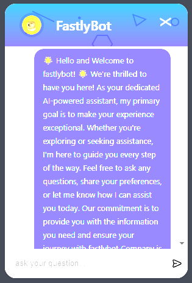

# React-Elevate-Sells-Connect

ElevateConnect our cutting-edge AI integration library, is your gateway to seamlessly infuse the power of artificial intelligence offered by [ElevateSells Intelligence](https://elevatesells.com) into any business application built on the React framework. ElevateConnect simplifies the integration process, offering a versatile suite of tools designed to enhance user experiences, optimize workflows, and elevate overall business performance. 

With its intuitive design and robust functionalities, ElevateConnect React empowers developers to effortlessly incorporate AI-driven insights, transforming applications into intelligent platforms that adapt and evolve alongside the dynamic needs of modern enterprises. Elevate your React applications to new heights with ElevateConnect React – where innovation meets simplicity, and intelligence becomes integral.

## Installation

Install the package via npm.

```bash
npm install react-elevate-sells-connect
```

## Client Setup
for experienced developers, you can access the client directly and interact with it in low level

```typescript
import {Client} from 'react-elevate-sells-connect';

const client = new Client({
    apiKey:"your elevate sells api key",
    assistantId:"your assistant id"
})
```

## Chat window 
### Usage

```typescript
import ChatWindow from 'react-elevate-sells-connect';

<ChatWindow apiKey="your elevate sells api key"
            assistantId="your assistant id"  
/>
```
<div align="center">
   <br><br>
</div>
